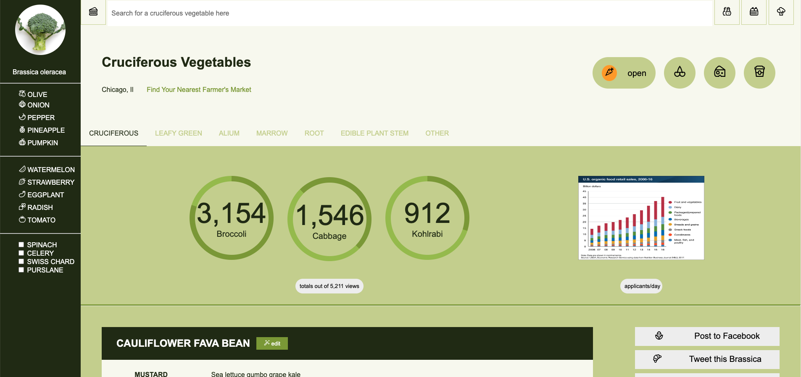

# Static Comp 
## Abstract
This project meets the requirements of this exercise: https://frontend.turing.edu/projects/M2-static-comp-challenge.html

## An image of the comp

## Technologies used
- HTML
- CSS

## Install/Setup instructions
You can view the project [here](https://chrissycooper.github.io/Static-Comp/)

## Wins & Challenges
I really appreciated this project as an exercise in HTML and CSS, there was a lot of aspects of building a site from scratch that I realized I needed more practice with like working out how to make pie charts with CSS. I really loved the challenge of setting up such a complex layout with flexbox. Alson, finding and utilizing all vegetable icons was a lot of fun. 